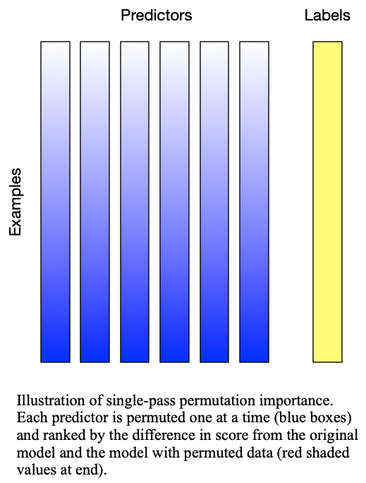
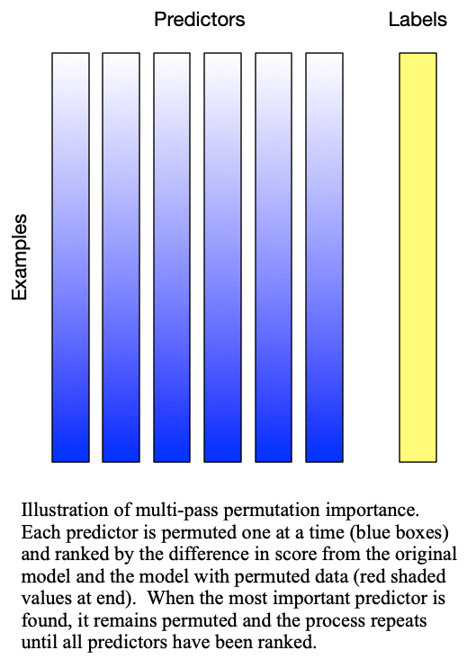

.. title:: Permutation Importance

Permutation Importance
======================

Theory
------

Permutation importance, the namesake for this package, determines the predictors which are important by comparing the performance of a model on a dataset where some of the predictors are individually permuted to performance on the original dataset without any permutation. The permutation of the individual predictor in this manner effectively breaks the relationship between the input predictor and the target variable. The predictor which, when permuted results in the worst performance is typically taken as the most important variable. Permutation importance has the distinct advantage of not needing to retrain the model each time.

This method was originally designed for random forests by :ref:`Breiman (2001)<permutation-references>`, but can be used by any model. The original version of the algorithm was :math:`O(n)`, but this was later revised by :ref:`Lakshmanan (2015)<permutation-references>` to be more robust to correlated predictors and is :math:`O(n^2)`. The difference between these two methods is detailed in :ref:`Fig. 1: Singlepass permutation importance<fig-singlepass-permutation>` and :ref:`Fig. 2: Multipass permutation importance<fig-multipass-permutation>`. While Breiman's method only permutes each predictor once independently, Lakshmanan's method iteratively adds one predictor to the set of predictors which are permuted at each iteration. Because Lakshmanan's method can be viewed as successively applying Breiman's method to determine the next-most important predictor, we typically refer to Breiman's method as "singlepass" and Lakshmanan's method as "multipass".

.. _fig-singlepass-permutation:

   
   Fig. 1: Singlepass permutation importance evaluates each predictor independently by permuting only the values of that predictor

.. _fig-multipass-permutation:

   
   Fig. 2: Multipass permutation importance performs singlepass permutation importance as many times as there as predictors to iteratively determine the next-most important predictor

Usage
-----

As with all methods, we provide the permutation importance method at two different levels of abstraction. For more information on the levels of abstraction and when to use each, please see :ref:`levels_of_abstraction`

Singlepass permutation importance is computed as a byproduct of the generalized method. To compute singlepass permutation importance only, set ``nimportant_vars=1``, which will only perform the multipass method for precisely one pass.

Typically, when using a performance metric or skill score with permutation 
importance, the ``scoring_strategy`` should be to minimize the performance. On the
other hand, when using an error or loss function, the ``scoring_strategy`` should
be to maximize the error or loss function.

Model-Based
^^^^^^^^^^^

.. autofunction:: PermutationImportance.permutation_importance.sklearn_permutation_importance
   :noindex:

Method-Specific
^^^^^^^^^^^^^^^

.. autofunction:: PermutationImportance.permutation_importance.permutation_importance
   :noindex:

.. _permutation-references:

References
----------
-  `Breiman, L., 2001: Random Forests.Machine Learning,45 (1), 5–32. <https://link.springer.com/content/pdf/10.1023/A:1010933404324.pdf>`_
-  `Lakshmanan, V., C. Karstens, J. Krause, K. Elmore, A. Ryzhkov, and S. Berkseth, 2015: Which polarimetric variables are important for weather/no-weather discrimination?Journal of Atmospheric and Oceanic Technology,32 (6), 1209–1223. <https://journals.ametsoc.org/doi/pdf/10.1175/JTECH-D-13-00205.1>`_
