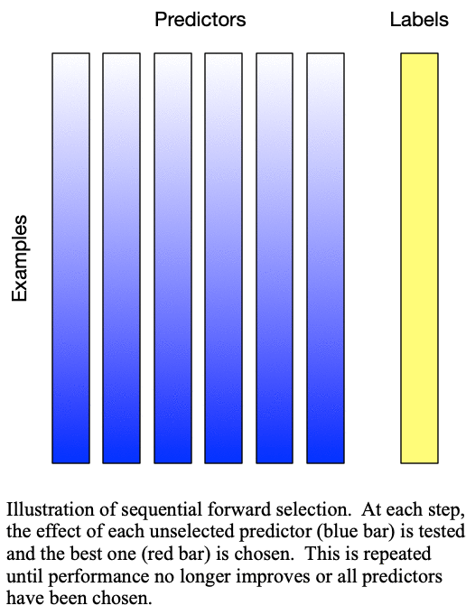
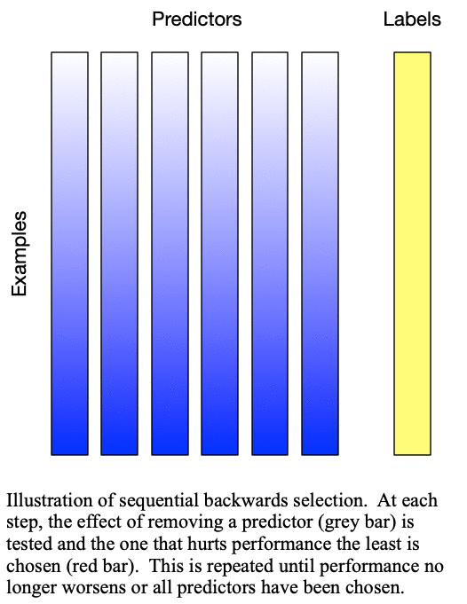

.. title:: Sequential Selection

Sequential Selection
====================

Theory
------

Sequential selection actually refers to an entire class of data-based methods. While there are many forms, we presently provide an implementation of the simplest two, sequential forward selection and sequential backward selection. A synopsis of these two methods, as well as several generalizations, can be found in Chapter 9 of :ref:`Webb (2003)<sequential-selection-references>`. Sequential selection methods determine which predictors are important by evaluating model performance on a dataset where only some of the predictors are present. Predictors which, when present, improve the performance are typically considered important and predictors which, when removed, do not or only slightly degrade the performance are typically considered unimportant. In contrast with permutation importance, sequential selection methods train a new model at every step and are generally much more computationally expensive.

Sequential Forward Selection
^^^^^^^^^^^^^^^^^^^^^^^^^^^^

Sequential forward selection iteratively adds predictors to the set of important predictors by taking the predictor at each step which most improves the performance of the model when added to the set of training predictors. This effectively determines the best :math:`k` predictors for training a :math:`k`-predictor model. The process is demonstrated in :ref:`Fig. 1: Sequential forward selection<fig-sfs>`.

.. _fig-sfs:

   
   Fig. 1: Sequential forward selection adds the next-best predictor at each step

Sequential Backward Selection
^^^^^^^^^^^^^^^^^^^^^^^^^^^^^

Sequential backward selection iteratively removes variables from the set of important variables by taking the predictor at each step which least degrades the performance of the model when removed from the set of training predictors. This effectively determines the :math:`k` least important predictors. The process is demonstrated in :ref:`Fig. 2: Sequential backward selection<fig-sbs>`. A word of caution: sequential backward selection can take many times longer than sequential forward selection because it is training many more models with nearly complete sets of predictors. When there are more than 50 predictors, sequential backward selection often becomes computationally infeasible for some models.

.. _fig-sbs:

   
   Fig. 2: Sequential backward selection removes the next-worst predictor at each step

Usage
-----

As with all methods, we provide all sequential forward selection methods at two different levels of abstraction. For more information on the levels of abstraction and when to use each, please see :ref:`levels_of_abstraction`

Typically, when using a performance metric or skill score with any sequential
selection method, the ``scoring_strategy`` should be to maximize the performance.
On the other hand, when using an error or loss function, the ``scoring_strategy``
should be to minimize the error or loss function.

Model-Based
^^^^^^^^^^^

.. autofunction:: PermutationImportance.sequential_selection.sklearn_sequential_forward_selection
   :noindex:

Simple SFS Example
""""""""""""""""""
.. literalinclude:: ../examples/simple_sklearn_sequential_forward_selection.py

Complex SFS Example
"""""""""""""""""""
.. literalinclude:: ../examples/complete_sklearn_sequential_forward_selection.py

.. autofunction:: PermutationImportance.sequential_selection.sklearn_sequential_backward_selection
   :noindex:

Simple SBS Example
""""""""""""""""""
.. literalinclude:: ../examples/simple_sklearn_sequential_backward_selection.py

Complex SBS Example
"""""""""""""""""""
.. literalinclude:: ../examples/complete_sklearn_sequential_backward_selection.py

Method-Specific
^^^^^^^^^^^^^^^

.. autofunction:: PermutationImportance.sequential_selection.sequential_forward_selection
   :noindex:

SFS Example
"""""""""""
.. literalinclude:: ../examples/custom_sequential_forward_selection.py

.. autofunction:: PermutationImportance.sequential_selection.sequential_backward_selection
   :noindex:

SBS Example
"""""""""""
.. literalinclude:: ../examples/custom_sequential_backward_selection.py

.. _sequential-selection-references:

References
----------
-  `Webb, A., 2003: Statistical Pattern Recognition. John Wiley & Sons, Chichester, United Kingdom. <http://www.ccas.ru/voron/download/books/machlearn/webb02statistical.pdf>`_
